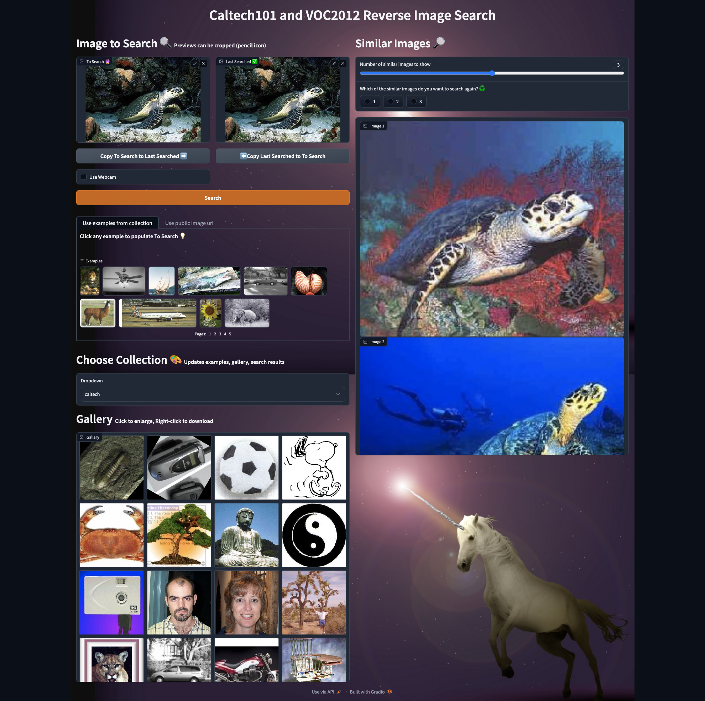
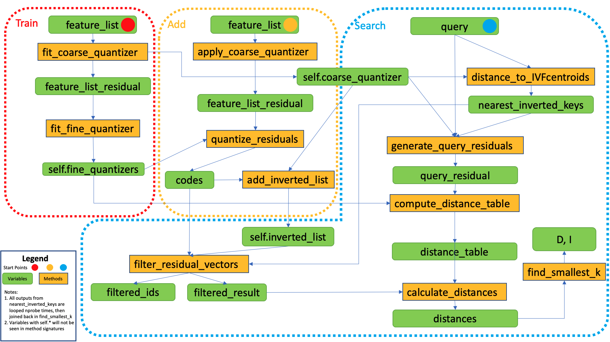

# Reverse Image Search



# Description :crystal_ball:

Lets you search for up to 5 similar images in [Caltech101 dataset](https://data.caltech.edu/records/mzrjq-6wc02), or [VOC2012 dataset](http://host.robots.ox.ac.uk/pascal/VOC/voc2012/#devkit) using pre-loaded indexes.

**Four ways of searching**

- Click the examples
- Upload your own
- Capture from webcam
- Paste a public url

**Refining your search**

- Crop the image
- Mirror between the 2 windows to compare while editing
- Reuse outputs as inputs

**How it works**

Resnet50 feature extractor turn images to 2048 dimensional vectors before being added to faiss IVF100,PQ8 index. Index update is not supported, but could happen by training new index then merging on disk.

# Setup :wrench:

1. **Create virtual environment and install requirements**

```
python -m venv .venv
source .venv/bin/activate
pip install -r requirements.txt
```

2. **Download data** (required if want to run gradio and show images)
   - `chmod u+x data_download.sh` to make script executable
   - `./data_download all` to download both caltech (1 minute) and voc2012 (6 minutes :warning:) (`all` can be substituted with `caltech` or `voc`)
3. **Create Indexes** (optional since already created)
   - `python gradio/create_index.py --data caltech` (`caltech` can be substituted with `voc`)
4. **Run gradio** (ensure `features` and `datasets` folder exist at same level as gradio folder)
   - `python gradio/block.py` (it will request webcam access, close browser tab running gradio to shut webcam)

# Folder Structure :file_folder:

```
.
├── Makefile
├── README.md
├── custom_ivfpq.py
├── custom_ivfpq_faiss.py
├── data_download.sh
├── datasets
│   ├── VOCdevkit
│   └── caltech101
├── features
│   ├── class_ids-caltech101.pickle
│   ├── features-caltech101-resnet-finetuned.pickle
│   ├── features-caltech101-resnet.pickle
│   ├── features-caltech101-resnetscratch.pickle
│   ├── features-voc2012-resnet.pickle
│   ├── filenames-caltech101.pickle
│   └── filenames-voc2012.pickle
├── figures
│   ├── gradio.png
│   ├── hnsw.png
│   ├── ivfdistance.png
│   ├── ivfoverview.png
│   ├── ivfpq.png
│   └── ivfumap.png
├── gradio
│   ├── block.py
│   ├── create_index.py
│   ├── index_ivfpq_caltech.index
│   ├── index_ivfpq_voc.index
│   └── interface.py
├── ivfpq.pptx
├── notebooks
│   ├── feature_extraction.ipynb
│   ├── index_search.ipynb
│   ├── runtime_experiments.ipynb
│   └── visualizations.ipynb
├── requirements.txt
└── test_custom_ivfpq.py
```

- `features` (366.5MB) and `datasets` (2GB) are not commited to version control
  - `features` - train your own using `feature_extraction.ipynb`, then download from colab to local
  - `datasets` - download using `data_download.sh` or manually

# File Content :books:

1. `custom_ivfpq_faiss.py` - pure python (except clustering section) implementation of [IVFPQ paper](https://lear.inrialpes.fr/pubs/2011/JDS11/jegou_searching_with_quantization.pdf), with tweaks in inverted file data structure
   - run with `python custom_ivfpq_faiss.py`, < 2 seconds to train
   - Development process in `notebooks/index_search.ipynb`
   - Editable API design in `ivfpq.pptx` 
2. `custom_ivfpq.py` - same content as previous, except using sklearn Kmeans instead of faiss.Kmeans for both coarse and fine quantizers
   - run with `python custom_ivfpq.py`, 40 seconds to fit, 20 seconds to predict all ~9000 caltech101 images
3. `test_custom_ivfpq.py` - tests for `custom_ivfpq_faiss.py`
   - run with `make pytest`
4. `gradio`
   - `block.py` - blocks (low level) gradio api, allows complete control of data flow
   - `interface.py` - interface (high level) gradio api, limited control of data flow
   - `create_index.py` - script to create indexes to store in same gradio folder, to be loaded by gradio for search
5. `notebooks`

   - `feature_extraction.ipynb` - Convert data to dense feature by fine-tuning models, to be indexed for search
     - run in colab for GPU, filepaths generated there are on root `/features`, `/datasets` to prevent network transfer latency with google drive, should remove leading / if run locally to prevent messing with filesystem
   - `runtime_experiments.ipynb`- Experiments on index/search runtime performances of sklearn KNN and Annoy libraries
     - :warning: Start notebook with `%cd ..` so current directory contains `notebooks` and `open()` can access `features`, `datasets`
   - `index_search.ipynb` - Experiments on speed, memory and recall tradeoffs of faiss ANN algorithms and custom implementations of IVFPQ (inverted file index with product quantization)
     - :warning: Start notebook with `%%cd ..` so current directory contains `notebooks` and `open()` can access `features`, `datasets`
   - `visualizations.ipynb` - [Federpy](https://github.com/zilliztech/feder) visualizations of faiss IndexIVFFlat and hnswlib
     - run in colab because hnswlib cannot be installed locally (`ERROR: Could not build wheels for hnswlib which use PEP 517 and cannot be installed directly`)
     - indexes and images are hosted on S3, local files [do not work](https://github.com/zilliztech/feder/issues/71#issuecomment-1436404523)
     - Example visualizations
       
       
       
       

```

```
